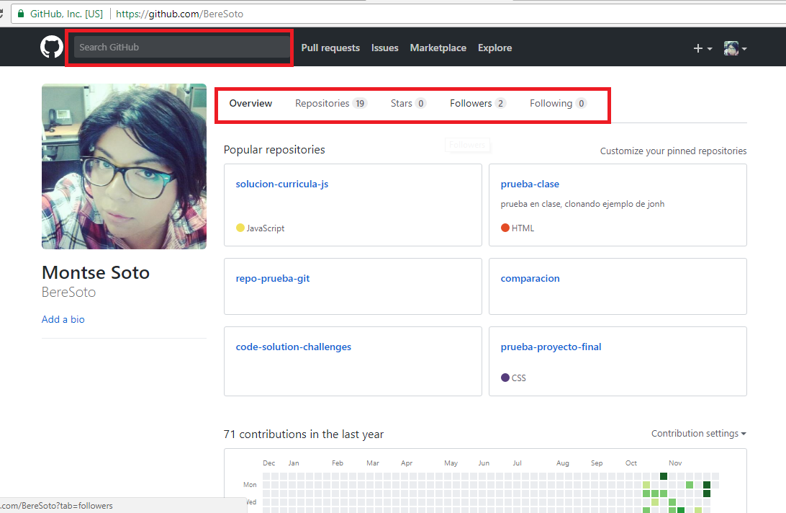
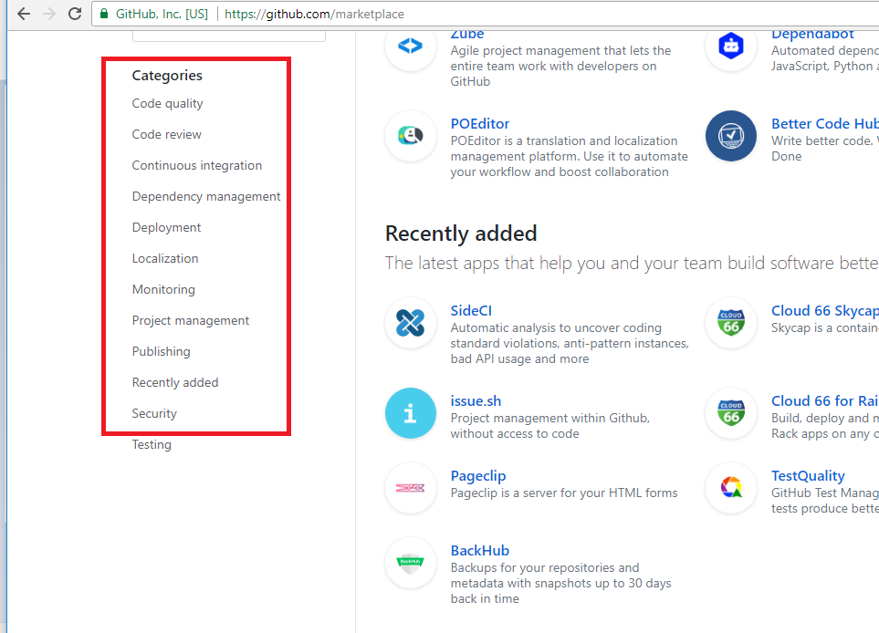
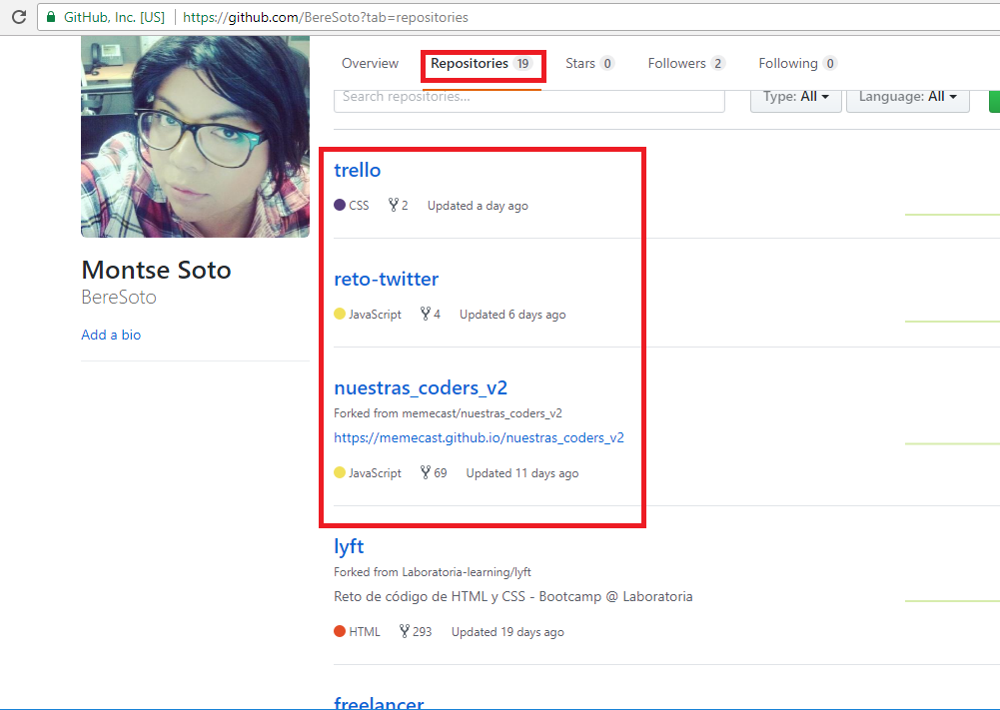
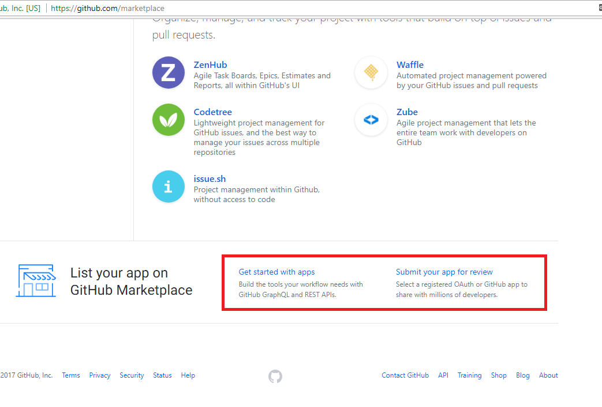

**Reto 2**

*Identificar los elementos de navegacion de github.*

GitHub es un sitio que es conocido por ser un administrador de proyectos el cual puedes usar de forma libre y de paga.

**Navegación global**

**Navegación Local**

En la siguiente imagen se muestra un ejemplo de navegación: Despues de pasar por la navegacion global, in gresamos a nuestro perfil donde nos encontramos con su propia navegacion, la cual nos ayudara a explorar estando ya dentro de github.

**Navegación Facetada**

En la siguiente imagen se muestra un ejemplo de este tipo de navegación, que nos ofrece un filtro no editable:

**Navegación Filtrada**

En la siguiente imagen se muestra  un ejemplo de este tipo de navegación.

**Navegación en Línea**

En la siguiente imagen se muestra algunos ejemplos de este tipo de navegación, en este caso links de referencia.

